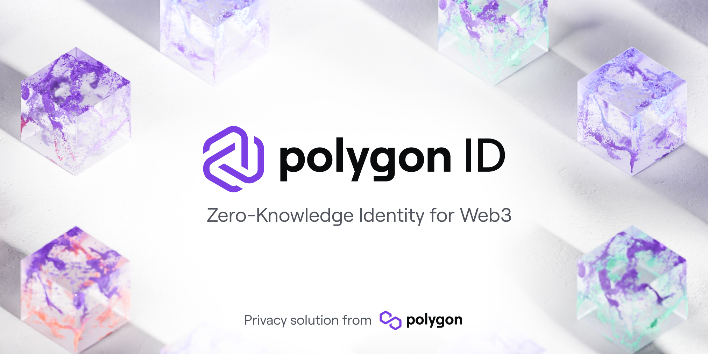

  

<h1 align="center">
  Polyon ID Demo
</h1>

A demo application of how to use [Polygon ID](https://0xpolygonid.github.io/tutorials/) in a Next.js application, showing how you can use zero-knowledge proofs to prove that you are over a certain age to the application without revealing your actual birthday.

 

## Running Locally

1. Clone the repository using `git clone`.
2. Install the dependencies with `npm install`.
3. Download the Polygon ID app on [iOS](https://apps.apple.com/us/app/polygon-id/id1629870183) or [Android](https://apps.apple.com/us/app/polygon-id/id1629870183).
4. Follow [Steph's quick setup guide](https://oceans404.notion.site/oceans404/How-to-get-a-KYCAgeCredential-Verifiable-Credential-f3d34e7c98ec4147b6b2fae79066c4f6) to get a demo VC from the [demo issuer](https://issuer-demo.polygonid.me/).
5. Create a new file called `.env.local` in the root of the project, and copy the contents of `.env.example` into it.
6. Run `npm run dev` and open [http://localhost:3000](http://localhost:3000) with your browser to start the application.
7. Install [ngrok](ngrok.com) on your machine so that you can expose your localhost API routes.
8. Using the ngrok CLI, expose your localhost API routes by running `ngrok http 3000` (for localhost:3000).
9. Update the `NEXT_PUBLIC_DEVELOPMENT_URL` in the `.env.local` file with your ngrok "Forwarding" URL.
10. Scan the QR code from the Polygon ID app to kick off the verification process.
11. (Optional): Create your own Polybase database using the schema in [PolybaseSchema.txt](./PolybaseSchema.txt) and update the `.env.local`'s `NEXT_PUBLIC_POLYBASE_NAMESPACE` value with your database namespace.

Get stuck? Send me a message in the [Discord](https://discord.com/invite/4eQBm7DDNS) and I'll help you out!

 

## How It Works

Polygon ID uses a trust triangle between three parties. The **Verifier**, **Prover** (identity holder) and **Issuer**:

1. Prover: The user trying to prove they are of legal age.
2. Verifier: The website owner, trying to verify that the prover is of legal age.
3. Issuer: A source of verifiable credentials that the verifier trusts. [(Demo issuer)](https://issuer-demo.polygonid.me/)

Using ZK proofs to verify your age as a user involves a 3-step process:

### 1. Issuer provides the prover with a verifiable credential (VC)

An issuer is an entity (person, organization, or thing) that issues VCs to provers (identity holders). VCs are stored in the user's Polygon ID wallet on [iOS](https://apps.apple.com/us/app/polygon-id/id1629870183) or [Android](https://apps.apple.com/us/app/polygon-id/id1629870183). In this example, we use a [demo issuer](https://issuer-demo.polygonid.me/) that issues a VC containing their birthday.

### 2. Prover submits ZK-proof to the verifier

Now the prover (user) has a verifiable credential containing their birthday. They can now generate ZK proofs from this VC and submit them to the verifier (the website) for verification to pass some requirements (age check).

This occurs by having the user scan a QR code on the website using the Polygon ID app. The QR code contains information about what credentials the verifier wants to check about the user; such as their birthday/age.

The Polygon ID app generates a ZK proof from the VC and submits it to the verifier.

### 3. Verifier verifies the proof

The verifier trusts the issuer and can verify the proof submitted by the prover.

If the proof passes the requirements, the verifier can allow the prover to access the website.

This occurs on the server-side, by having a smart contract verify the submitted proof.

## App Architecture

Importantly, before any of this can happen, the prover must have received a verified credential from the issuer. In this demonstration, you can use the [demo issuer](https://issuer-demo.polygonid.me/) to receive a verified credential containing your birthday.

For the full-on setting up Polygon ID wallet app and claiming a VC from the demo issuer, please check out [Steph's quick setup guide](https://oceans404.notion.site/oceans404/How-to-get-a-KYCAgeCredential-Verifiable-Credential-f3d34e7c98ec4147b6b2fae79066c4f6).

The application uses both client and server to implement the trust triangle:

- The **client** acts as the prover, trying to prove their age on the website.
- The **server** acts as the verifier, verifying the proof submitted by the prover.

The flow of data is simplified in the below diagram:

Since Next.js is a server-less framework, we don't maintain state on the server; which means we need to introduce a database, to store the information of both the QR code requests and the results of the verification process.

Including the database (built on [Polybase](https://polybase.xyz/docs/get-started)), here is how the application is structured:

The above diagram shows the flow of data in the application, and the following steps:

1. The client creates a unique ID for this session.
2. When the page loads, the client requests the server to generate a QR code.
3. The QR code gets generated by the server, and:
   - The server stores the request in the database, with the unique ID of this session.
   - The server returns the QR code to the client.
4. The client displays the QR code.
5. The user scans the QR code with the Polygon ID app.
6. The Polygon ID app generates a ZK proof from the VC and submits it to the server.
7. The server verifies the proof, and:
   - The server stores the result in the database, with the unique ID.
8. The client checks every 5 seconds if a verification result is available in the database for the unique ID of this session.

